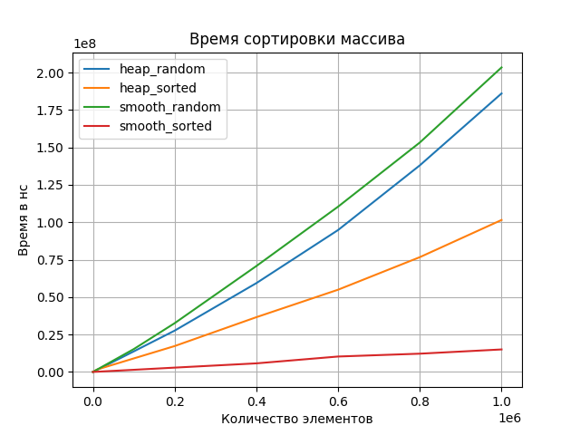

# Семестровая работа по АСД (smooth sort)
Выполнили Кирасиров Данис и Камалов Нияз (11-104)

## Результаты



Теория:

|            | Best       | Average    |
|------------|------------|------------|
| HeapSort   | O(n*log n) | O(n*log n) |
| SmoothSort | O(n)       | O(n*log n) |

В теории HeapSort и SmoothSort должны показывать похожие результаты на случайных данных (O(n*logn)), 
но на отсортированных данных SmoothSort должен быть лучше (O(n) vs O(n*logn)).

По графику SmoothSort медленнее на случайных данных из-за дополнительной логики, но на отсортированных - намного быстрее. В целом, теория совпадает с практикой.

## Зависимости
Проект выполнен на языке программирования [Golang](https://go.dev/doc/install).
Генерация данных и отрисовка графиков осуществляется на [Python](https://www.python.org/downloads/).
Для запуска необходимо:
1) Установить языки (по ссылкам)
2) Установить библиотеку matplotlib для питона (```pip3 install matplotlib```)
3) Скачать проект (```git clone git@github.com:py354/semester-project-smooth-sort.git```)
4) Запустить генератор данных (```python3 generate_dataset.py```)
5) Запустить бенчмарк (```go run benchmark.go```)
6) Создать график из результатов (```python3 make_plot.py```)
## Структура проекта
```dataset/``` - папка с входными данными (генерируются)

```sort/``` - реализация smooth sort и heap sort на golang

```utils/``` - вспомогательный код (для измерения времени и чтения входных данных)

```result/``` - результат измерений

```generate_dataset.py``` - скрипт генерации данных

```benchmark.go``` - скрипт замера времени выполнения

```make_plot.py``` - скрипт отрисовки получившихся данных

## Ход работы
Команды запуска будут указаны под Linux, т.к. работа велась на Ubuntu.

### Генерация входных данных
```sh
$ python3 generate_dataset.py
```
Создается 9 типов наборов входных данных, каждый тип это определённое
кол-во чисел (1е2, 1е3, ..., 1е6). Для каждого типа генерируется по 10 видов:
```
dataset/
  v1/
    100.csv
    1000.csv
    10000.csv
    100000.csv
    200000.csv
    400000.csv
    600000.csv
    800000.csv
    1000000.csv
  v2/
  ...
  v10/
  ...
```
### Бенчмаркинг
```sh
$ go run benchmark.go
```
Измеряется время сортировки массива. Для каждого набора выполняется по 10 проходов. В итоге
делается по 100 измерений для каждого типа (v1/100.csv, v2/100.csv, ..., v10/100.csv),
средний результат является итоговым. Отдельно выполняется замер на отсортированном массиве.

Результат записывается в папку ```result/``` в формате csv (кол-во данных, время в нс)